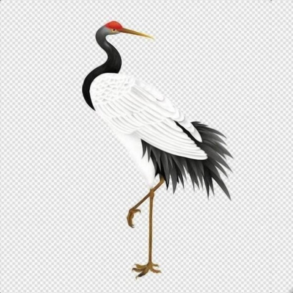

## 〇 无极 〇

* 未名 世玄
* 全真龙门派散修弟子
* 不会code的IT从业者

## 我的环境

* system 

``` text
    debian
    i3+tint2
    rofi
    sakura
    vim
    cheat
    firefox
```

* Hardware 

``` text
LFS用户
走到哪里用到哪里把linux传染到哪里
想拥有一台工业设计比得上macbook的linux本本。

Phone
    huawei P20 
        termux 
        firefox

希望啥时候能舍得弄一个 HHKB
```

* My-project

``` c
#include <stdio.h>
void main() 
{
      printf("Hello, world\n");
}
```

``` text
底层爱好者 
看过三页 minix 
知道 linux source 源码结构
gnu 窃贼
```

KISS = Keep It Simple and Stupid

无形无相 有形有相 执念而成
--2014.12.11

[遗嘱](/dao/遗嘱.md) 

## 鹤

</img>

## mail

yy(#)nones.top
