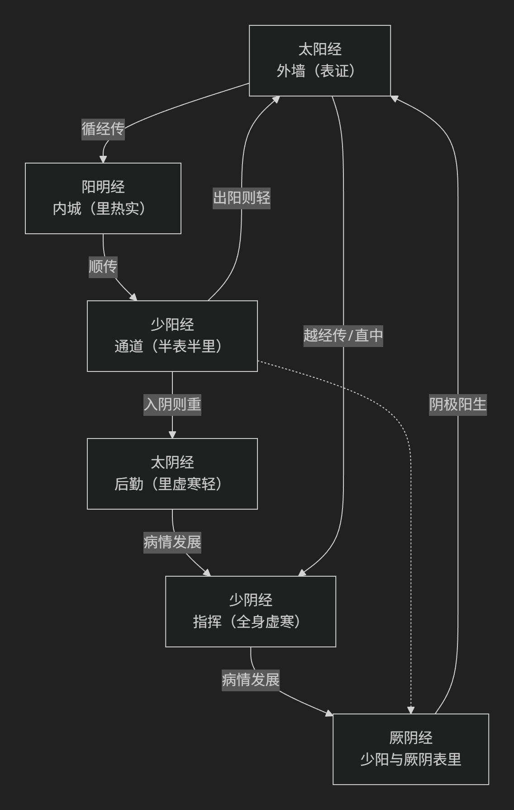

# 伤寒论笔记

群体方案
个体方案

寒：邪气
论：综述 总结

春弦、夏洪、秋毛、冬石

三阳病（表、实、热证）：
正气未虚，邪正斗争激烈。
太阳病：
表证阶段。恶寒发热，头项强痛，脉浮。
阳明病：
里热实证阶段。但热不寒，大汗，大渴，脉洪大。
少阳病：
半表半里阶段。寒热往来，口苦咽干，胸胁苦满。

三阴病（里、虚、寒证）：
正气已虚，机能衰退。
太阴病：
脾胃虚寒证。腹满而吐，食不下，自利。
少阴病：
心肾阳虚证。脉微细，但欲寐，四肢厥冷。
厥阴病：
寒热错杂证。厥热胜复，上热下寒。

八纲辨证：阴阳、表里、寒热、虚实。

循经传 
越经传
表里传（夫妻传）

治法
   扶阳 保胃 调津液
   汗 吐 下 和 温 清 补 消 涩

113 方  93味

理 法 方 药

六经辨证和脏腑的关系

- 太阳经：
与膀胱和小肠相联系，
主表，统摄营卫，负责抵御外邪。
气血运行不畅，发热、恶寒、头痛等
- 阳明经：
与胃和大肠相联系，
主里，消化和吸收。
气血运行不畅，发热、口渴、大便秘结
- 少阳经：
与胆和三焦相联系，
主半表半里，调节气血津液的运行。
气血运行不畅，往来寒热、胸胁苦满、心烦喜呕等。
- 太阴经：
与脾和胃相联系，
主里，运化水谷和津液。
气血运行不畅，腹满而吐、食不下、自利益甚等。
- 少阴经：
与心和肾相联系，
主里，气血阴阳的调节。
气血运行不畅，脉微细、但欲寐、四肢厥冷等症状。
- 厥阴经：
与肝和心包相联系，
主里，气血的运行和情志的调节。
气血运行不畅，消渴、气上撞心、心中疼热等症状。

太阴 → 阳明 → 阳明 → 太阴 → 少阴 → 太阳
 ↑                                ↓ 
厥阴 ← 少阳 ← 少阳 ← 厥阴 ← 少阴 ← 太阳

外墙（太阳） 内城（阳明） 道路（少阳）
后勤（太阴） 指挥（少阴） 厥阴（混乱 转机）

手 → 手 → 足 → 足 → 手 → 手
↑                        ↓ 
足 ← 足 ← 手 ← 手 ← 足 ← 足

肺经 → 大肠 → 胃经 → 脾经 → 心经 → 小肠
 ↑                                ↓ 
肝经 ← 胆经 ← 三焦 ← 心包 ← 肾经 ← 膀胱

手 太阴 肺经 → 手 阳明 大肠经   阴转阳 
足 阳明 胃经 → 足 太阴 脾经     阳转阴 
手 少阴 心经 → 手 太阳 小肠经   阴转阳
足 太阳 膀胱 → 足 少阴 肾经     阳转阴
手 厥阴 心包 → 手 少阳 三焦经   阴转阳 
足 少阳 胆经 → 足 厥阴 肝经     阳转阴
    
一、 太阳病 (表证阶段)
核心病机：风寒外袭，营卫失调。
核心脏腑/经络：肺（卫气）、足太阳膀胱经。
典型脉象：
浮脉：总纲。邪气在表，正气抗邪于外。
浮紧脉：风寒表实（伤寒证）。卫阳被遏，营阴郁滞。关联膀胱经气机闭塞。
浮缓脉：风寒表虚（中风证）。卫外不固，营阴外泄。关联肺卫气虚。

二、 阳明病 (里热实证)
核心病机：燥热炽盛，津液受伤。
核心脏腑：胃、大肠。
典型脉象：
洪大脉：阳明经证。胃热炽盛，气血沸腾。核心在胃。
沉实脉/滑数脉：阳明腑证。热结大肠，腑气不通。核心在大肠。

三、 少阳病 (半表半里证)
核心病机：少阳枢机不利，气郁火结。
核心脏腑：胆、三焦。
典型脉象：
弦脉/弦细脉：胆气郁结，三焦水道不畅。正邪分争于半表半里。核心在胆腑疏泄失常和三焦气机阻滞。

四、 太阴病 (里虚寒证)
核心病机：脾阳虚衰，寒湿内停。
核心脏腑：脾。
典型脉象：
缓弱脉/沉迟而无力：脾阳不足，运化失职，气血鼓动无力。核心在脾的虚寒。

五、 少阴病 (全身虚衰证)
核心病机：心肾阳衰，阴阳俱虚。
核心脏腑：心、肾。
典型脉象：
微细脉：心肾阳气衰微，阴血也亏。此为阳虚为主的危重证。
细数无力脉：阴虚为主，虚阳外越或虚火内动。核心在心肾功能的严重衰退。

六、 厥阴病 (寒热错杂证)
核心病机：阴阳失调，寒热错杂。
核心脏腑：肝、心包。
典型脉象：
无特定单一脉象，多为复杂脉（如弦、数、迟、沉交替出现）。
这反映了肝的疏泄功能失常和心包的气机逆乱，导致上热下寒、阴阳之气不相顺接的复杂局面。

## 桂枝汤（桂枝、芍药、甘草、生姜、大枣）

    解肌发表，调和营卫
    太阳中风表虚证（发热、汗出、恶风、脉浮缓）

        桂枝加葛根汤：桂枝汤 + 葛根。主治太阳中风兼项背强几几。
        桂枝加厚朴杏子汤：桂枝汤 + 厚朴、杏仁。主治桂枝汤证兼喘咳。
        桂枝加附子汤：桂枝汤 + 附子。主治桂枝汤证兼阳虚漏汗、四肢微急。
        桂枝去芍药汤：桂枝汤 - 芍药。主治表证未解而胸满者。
        桂枝去芍药加附子汤：桂枝去芍药汤 + 附子。主治胸满兼阳虚畏寒。
        桂枝新加汤：桂枝汤 + 芍药、生姜、人参。主治营卫不和，气血不足之身疼痛。
        桂枝去桂加茯苓白术汤：桂枝汤 - 桂枝 + 茯苓、白术。主治表证未解，水气内停，头项强痛，小便不利。
        小建中汤：桂枝汤倍芍药 + 饴糖。主治中焦虚寒，腹中急痛。
        黄芪建中汤：小建中汤 + 黄芪。主治虚劳里急，诸不足

## 麻黄汤（麻黄、桂枝、杏仁、甘草）

    发汗解表，宣肺平喘
    太阳伤寒表实证（恶寒发热、头身疼痛、无汗而喘）

        大青龙汤：麻黄汤 + 石膏、生姜、大枣。主治表寒里热烦躁。
        小青龙汤：麻黄汤去杏仁，加干姜、细辛、五味子、半夏、芍药。主治外寒内饮。
        麻黄杏仁甘草石膏汤：麻黄汤 - 桂枝 + 石膏。主治邪热壅肺之喘咳。
        麻黄细辛附子汤：麻黄、细辛、附子。主治少阴病兼表证。
        麻黄附子甘草汤：麻黄、附子、甘草。主治少阴病轻证兼表证

## 小柴胡汤（柴胡、黄芩、半夏、人参等）

    和解少阳，治半表半里证。
    少阳病（往来寒热、胸胁苦满、心烦喜呕、口苦咽干）

        大柴胡汤：小柴胡汤 - 人参、甘草 + 大黄、枳实、芍药。主治少阳阳明合病。
        柴胡加芒硝汤：小柴胡汤 + 芒硝。主治少阳兼里实轻证。
        柴胡桂枝汤：小柴胡汤 + 桂枝汤（各取半量）。主治太阳少阳并病。
        柴胡桂枝干姜汤：小柴胡汤去人参、生姜、大枣、半夏 + 桂枝、干姜、牡蛎、瓜蒌根。主治少阳兼水饮内结。
        柴胡加龙骨牡蛎汤：小柴胡汤 + 龙骨、牡蛎、铅丹、桂枝、茯苓、大黄。主治少阳兼心神不宁、烦惊谵语

## 白虎汤（石膏、知母、粳米、甘草）

   清热生津，治阳明经热盛。
   阳明经热盛（大热、大汗、大渴、脉洪大）

        白虎加人参汤：白虎汤 + 人参。主治阳明热盛，气阴两伤。
        竹叶石膏汤：白虎汤去知母，加竹叶、人参、麦冬。主治热病后期，余热未清，气津两伤

## 大承气汤（大黄、芒硝、枳实、厚朴）

    峻下热结，攻下热结，治阳明腑实证。
    阳明腑实重证（痞、满、燥、实俱全）

        小承气汤：大承气汤 - 芒硝，并减枳、朴用量。主治痞、满、实而不燥。
        调胃承气汤：大承气汤 - 枳实、厚朴 + 甘草。主治燥、实为主，痞、满不甚。
        桃核承气汤：调胃承气汤 + 桃仁、桂枝。主治瘀热互结之下焦蓄血证。
        麻子仁丸：小承气汤 + 麻仁、杏仁、芍药。主治胃强脾弱之脾约证。

## 半夏泻心汤 (半夏、黄芩、干姜、人参、甘草、黄连、大枣)

    辛开苦降，消痞和胃
    寒热错杂之痞证（心下痞满不痛，肠鸣下利）

        生姜泻心汤：半夏泻心汤 - 干姜 + 生姜。主治水热互结之心下痞，噫气食臭。
        甘草泻心汤：半夏泻心汤重用甘草。主治误下后胃气更虚之痞证。
        黄连汤：半夏泻心汤 - 黄芩 + 桂枝。主治上热下寒之腹痛欲呕。
        旋覆代赭汤：生姜泻心汤去芩、连 + 旋覆花、代赭石。主治痰气痞，噫气不除

## 理中汤 (人参、白术、干姜、甘草)

    温中祛寒，补气健脾
    太阴病脾胃虚寒（腹满、吐利、食少、畏寒）
    
        桂枝人参汤：理中汤 + 桂枝。主治脾胃虚寒兼表证。
        四逆汤：附子、干姜、甘草。主治少阴病阴盛阳衰，四肢厥逆。回阳救逆之首方
        通脉四逆汤：四逆汤加重附子、干姜。主治阴盛格阳，脉微欲绝。
        白通汤：四逆汤 - 甘草 + 葱白。主治阴盛戴阳证。
        白通加猪胆汁汤：白通汤 + 猪胆汁、人尿。主治阴盛戴阳，服热药后格拒者。
        四逆加人参汤：四逆汤 + 人参。主治亡阳脱液，四肢厥逆而脉微欲绝

        四逆散（柴胡、芍药、枳实、甘草） 阳气内郁 调和肝脾之基础方

## 栀子豉汤类 (栀子、豆豉)

    清宣郁热，除烦
    热扰胸膈（虚烦不得眠、心中懊憹）

        栀子甘草豉汤：栀子豉汤 + 甘草。主治兼少气乏力。
        栀子生姜豉汤：栀子豉汤 + 生姜。主治兼恶心呕吐。
        栀子厚朴汤：栀子豉汤 - 豆豉 + 枳实、厚朴。主治热扰胸膈兼腹满。
        栀子干姜汤：栀子豉汤 - 豆豉 + 干姜。主治上热中寒下利。
        栀子柏皮汤：栀子甘草豉汤 - 豆豉 + 黄柏。主治湿热发黄。

## 苓桂术甘汤类（茯苓、桂枝、白术、甘草）

    温阳健脾，化气利水
    中阳不足，水饮内停（心下逆满、头眩、心悸）

        茯苓桂枝甘草大枣汤：苓桂术甘汤 - 白术 + 大枣。主治心阳虚，欲作奔豚。
        茯苓甘草汤：苓桂术甘汤 - 白术 + 生姜。主治水停中焦，口不渴。
        五苓散：苓桂术甘汤 - 甘草 + 猪苓、泽泻。太阳蓄水证（小便不利、口渴、水入即吐）

## 附子汤（附子、茯苓、人参、白术、芍药）

    温经散寒，祛湿止痛，
    少阴病寒湿身痛证（身体痛，骨节痛，手足寒，脉沉）

        真武汤：附子汤 - 人参 + 生姜少阴病阳虚水泛证（腹痛，小便不利，四肢沉重疼痛，心下悸，头眩，身瞤动）附子汤偏于温补，治寒湿凝滞；真武汤偏于温散，治水气泛滥。

炙甘草汤​ 甘草、生姜、桂枝、人参、生地、阿胶、麦冬、麻仁、大枣、清酒

    滋阴养血，益气温阳，复脉定悸，阴血不足，阳气虚弱所致之脉结代、心动悸
    又名复脉汤，益气养血滋阴之代表方

黄连阿胶汤​ 黄连、黄芩、芍药、阿胶、鸡子黄

    滋阴降火，除烦安神 少阴病，心中烦，不得卧
    清热育安神之代表方

乌梅丸​ 乌梅、细辛、干姜、黄连、附子、当归、黄柏、桂枝、人参、川椒

    清上温下，安蛔止痛 蛔厥证（脘腹阵痛，烦闷呕吐），久痢久泻属寒热错杂者
    治寒热错杂、蛔虫证之祖方

白头翁汤​ 白头翁、黄柏、黄连、秦皮

    清热解毒，凉血止痢 热毒血痢（腹痛，里急后重，肛门灼热，下痢脓血）
    治热痢之代表方

吴茱萸汤​ 吴茱萸、人参、生姜、大枣

    温中补虚，降逆止呕 肝胃虚寒，浊阴上逆（食谷欲呕，头痛干呕吐涎沫）
    温胃散寒降逆之代表方

芍药甘草汤​ 芍药、甘草

    酸甘化阴，缓急止痛 津液受损，阴血不足，筋脉失濡所致之脚挛急，或脘腹疼痛
    缓急止痛之基础方