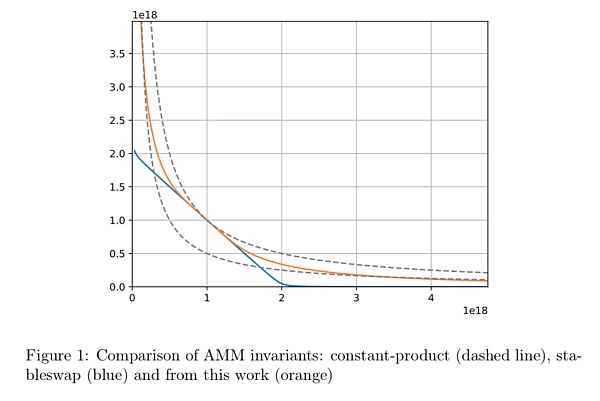

# 自动做市商（AMM）算法的数学原理

## Bancor Network 的联合曲线

联合曲线模型可以理解为描述“代币买卖价格”与“代币发行总量”之间的函数关系，可以由智能合约以去中心化的方式自动执行。

代币价格由其供应量决定 

税收销毁机制

## 基础信息

    消耗品 ERC20
    持有证明 ERC721
    证卷  ERC1400 ERC1410
    可组合物 ERC998

## 连续代币模型的单键曲线

<font size=7>$y=m\big(1+a\%) ^{\log_cx} +b$</font>

```text
其中 a 代表每个要素增加的价格增长百分比， b 是根据 y = mx + b 的调整函数的常数， c 是要素增加的基数（例如 2 表示翻倍），并且 m 是一个乘法因子，用于调整所定义曲线的“斜率​​”。
```

## 预言机

预言机就是一种单向的数字代理，可以查找和验证真实世界的数据，并以加密的方式将信息提交给智能合约。预言机就好比区块链世界中的一个第三方数据代理商。

## Curve V2

<font size=7>$KD^{N-1}\sum x_i + \prod x_i=KD^N+(\frac D N)^N$</font>

<font size=5>$K_0=\frac{\prod{x_i}N^N}{D^N}, K=AK_0\frac{\gamma^2}{(\gamma+1-K_0)^2},$</font>

其中，x 是每项资产的储备量，n 是资产的数量(Token数量)，D 是代表储备量中价值的不变量。K 是 " 放大系数 "（这是一个可调控的常数），它提供了一个类似于杠杆的效应并影响资产价格变化的范围。



公式里最杂乱的引入变量是 $\gamma$，它的由来要从图中的两条稳定乘积曲线来讲。上方稳定乘积曲线与Curve V1表达式一起成就了V2曲线的“均衡点”区域规模，而下方稳定乘积曲线是对上方稳定乘积曲线的一个参数化缩小，即

上方稳定乘积曲线：
    <font size=5>$x*y = (\frac D N)^N$</font>

下方稳定乘积曲线：
    <font size=5>$x*y = \gamma (\frac D N)^N$</font>

gamma是一个很小的正小数，在曲线形状上会比上方曲线更缩进原点。如前所述，CurveV2 需求引入这么一条gamma曲线，使得V2 曲线脱节V1曲线在中、尾段的劣势（流动性枯竭和快速呼应汇率改变），也就是让曲线具有更大的后半段曲率。

### Curve内部预言机

其实Curve V2还有一项十分重要的立异——内部预言机repegging机制。这项机制对实施更好的会集流动性以及减缓无常丢失是十分有利的。

Curve V2 引入了一种price_scale的价格度量，比如池子中有USDT 和B_token两种资产，balance为b=[1000,500]，汇率上1 B = 2USDT，则price 为p=[1,2]，最后相乘取得一种scaledbalance 为x=[1000,1000]。

<font size=5>$X_i=b_i*p_i$</font>

随着商场汇率的改变、兑换的发生、LP做市行为的影响，体系坐标点会逐步违背原始“均衡点”，假如不加以纠正曲线形状，不只会造成流动性的集合性削弱，还会带来无常丢失。CurveV2 为此提出了MarketPrice Update 机制

### Curve总结
Curve V2引领性的两大立异机制：新曲线和repegging。这条新曲线不只静态杂乱，还具有了动态属性，能够依据EMA 和Xcp智能呼应体系偏移，让池子流动性最大化地集合在当时汇率规模内，极大地提高了动态资本效率，这是能够超越Uni V3的地方。咱们最终会发现，CurveV2 能够与Uni V3再组合。

## uniswap V3

Uniswap v1 v2 版本使用 x⋅y=k(恒定乘积) 这样一个简洁的公式实现了 AMM Dex.因为 v2 无法满足某些特定需求，从而诞生了 Curve, Balancer 这些针对某些功能进行改进的 AMM

DAI/ETH，交易对的流动性池中共有资金：4500 DAI 和 3 ETH，根据 x⋅y=k，可以算出池内的 k 值：

$k=4500*3=13500$

价格下降到 1300 DAI/ETH 时：

<font size=5>

$$
\begin{cases}
x_2*y_2=13500 \\
\frac {x_2}  {y_2} = 1300\\
\end{cases}
$$
</font>

$$
x_2 = 41952.54 \ ,\ y_2 = 3.22
$$

简单来说，官方认为 v2 版本最大的痛点是资金利用率（Capital Efficiency）太低，v3 版本在解决这个问题的同时，还带了了新的改进，总体总结如下：

    可灵活选择价格区间提供流动性
    更好用的预言机
    order book 功能
    灵活的费率


