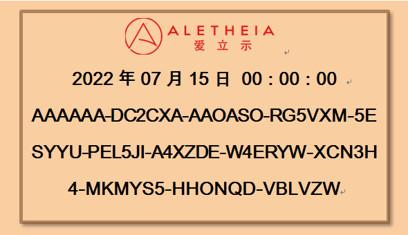

# 大话 ERC-**

## ERC 20 
    name
    decimals 位数
    totalSupply 总量
    balanceOf 余额
    transfer 转账
    transferFrom 从地址转账
    approve 允许授权


[接口实现](https://docs.openzeppelin.com/contracts/4.x/erc20)

[github.com](https://github.com/OpenZeppelin/openzeppelin-contracts/blob/master/contracts/token/ERC20/ERC20.sol)

## EIP-55 混合大小写校验和地址编码
钱包地址大小写混用测试方法


    test("0x5aAeb6053F3E94C9b9A09f33669435E7Ef1BeAed")
    test("0xfB6916095ca1df60bB79Ce92cE3Ea74c37c5d359")
    test("0xdbF03B407c01E7cD3CBea99509d93f8DDDC8C6FB")
    test("0xD1220A0cf47c7B9Be7A2E6BA89F429762e7b9aDb")


[地址](https://eips.ethereum.org/EIPS/eip-55)

## EIP-181 ENS

```text
    reverseRegistrar.claim(msg.sender)

    function name(bytes32 node) constant returns (string)
```

ENS 注册表的地址位于 0x112234455c3a32fd11230c42e7bccd4a84e02010有任何反向记录存储在 112234455c3a32fd11230c42e7bccd4a84e02010.addr.reverse

## EIP-191：签名数据标准



#### 普通文本签名
keccak256(abi.encode(_text, _anotherText));


标准以太坊交易可以提交为 signed_data

```
0x19 <1 byte version> <version specific data> <data to sign>.
```

    r，s是ECDSA 签名的输出，v是恢复 ID
    简单理解V
        偶数r，我们得到v = 27，奇数r我们得到v = 28

```javascript
// 钱包地址 数量 签名数据 nonce v r s
function submitTransactionPreSigned(address destination, uint value, bytes data, uint nonce, uint8 v, bytes32 r, bytes32 s)
    public
    returns (bytes32 transactionHash)
{
    // Arguments when calculating hash to validate
    // 1: byte(0x19) - the initial 0x19 byte
    // 2: byte(0) - the version byte
    // 3: this - the validator address
    // 4-7 : Application specific data
    transactionHash = keccak256(abi.encodePacked(byte(0x19),byte(0),address(this),destination, value, data, nonce));
    sender = ecrecover(transactionHash, v, r, s);
    // ...
}
```

## EIP-721：不可替代的代币标准 (NFT)


```text
  身份 门票 数藏 证明 众筹 投票 域名  转让 
  知识证明 所有权 防伪 金融 音乐 邮件 医疗(?)
  知识产权 资产 会员资格 内容 证书 文件
```
```text
Transfer
Approval
ApprovalForAll  可以管理所有NFT
balanceOf       查询所有
ownerOf
safeTransferFrom  可以有附加数据,重载
transferFrom 
setApprovalForAll
getApproved
isApprovedForAll
```

ERC165
  supportsInterface

ERC721Metadata (元数据)
    name
    symbol 缩写
    tokenURI
    我们可以添加

ERC721Enumerable
   totalSupply 返回NFT总量
   tokenByIndex  ID
   tokenOfOwnerByIndex _owner拥有的NFT列表中对应索引的tokenId

一个可接收NFT的合约必须实现ERC721TokenReceiver接口：
```javascript
    interface ERC721TokenReceiver {
        /// @return `bytes4(keccak256("onERC721Received(address,uint256,bytes)"))`
        function onERC721Received(address _from, uint256 _tokenId, bytes data) external returns(bytes4);
    }
```
transferFrom(): 用来转移NFTs, 方法成功后需触发Transfer事件。调用者自己确认_to地址能正常接收NFT，否则将丢失此NFT。此函数实现时需要检查上面条件的前4条。


我们可以根据需要添加自己的逻辑，如加入黑名单等。
同时挖矿、销毁尽管不是标准的一部分，我们可以根据需要实现。


## eip-165

    如何识别接口
    合约如何发布它实现的接口
    如何检测合约是否实现了 ERC-165
    如何检测合约是否实现了任何给定的接口

如何检测合约是否实现了任何给定的接口
    如果您不确定合约是否实现了 ERC-165，请使用上述程序进行确认。
    如果它没有实现 ERC-165，那么你将不得不看看它使用了哪些方法。
    如果它实现了 ERC-165，那么只需调用 supportsInterface(interfaceID)确定它是否实现了您可以使用的接口。


[理解](https://github.com/ethereum/EIPs/blob/master/EIPS/eip-165.md)

##  EIP-1155：多令牌标准

管理多种代币类型的合约的标准接口。 单个部署的合约可能包括可替代代币、不可替代代币或其他配置（例如半可替代代币）的任意组合。

ERC-20 和 ERC-721 等代币标准要求为每种代币类型或集合部署单独的合约。 这会在以太坊区块链上放置大量冗余字节码，并通过将每个代币合约分离到其自己的许可地址的性质来限制某些功能。 随着区块链游戏和恩金币等平台的兴起，游戏开发者可能正在创造数千种代币类型，需要一种新的代币标准来支持它们。 但是，ERC-1155 并非特定于游戏，许多其他应用程序都可以从这种灵活性中受益。 


不要重复造轮子,除非你有改造轮子的能力.
                                ---- 鲁迅

[Horizon Games - 多代币标准 ](https://github.com/0xsequence/erc-1155)

[open zeppelin 1155](https://github.com/OpenZeppelin/openzeppelin-contracts/tree/master/contracts/token/ERC1155)

[open zeppelin 1155 doc](https://docs.openzeppelin.com/contracts/4.x/api/token/erc1155)

## EIP-998 可组合不可替代令牌标准

    ERC998ERC721 自上而下的可组合代币，用于接收、持有和转移 ERC721 代币
    ERC998ERC20 自上而下的可组合代币，用于接收、持有和转移 ERC20 代币
    ERC998ERC721 自下而上的可组合令牌，将自身附加到其他 ERC721 令牌。
    ERC998ERC20 自下而上的可组合令牌，将自身附加到 ERC721 令牌。

[EIP-998](https://eips.ethereum.org/EIPS/eip-998)
