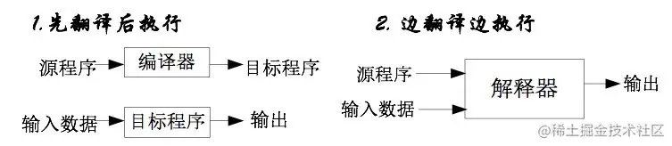
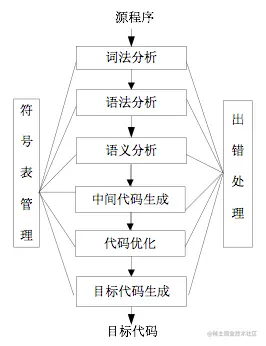
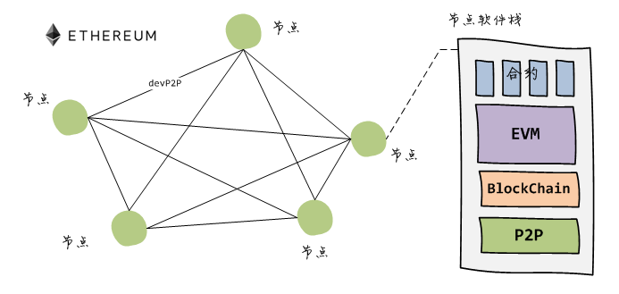
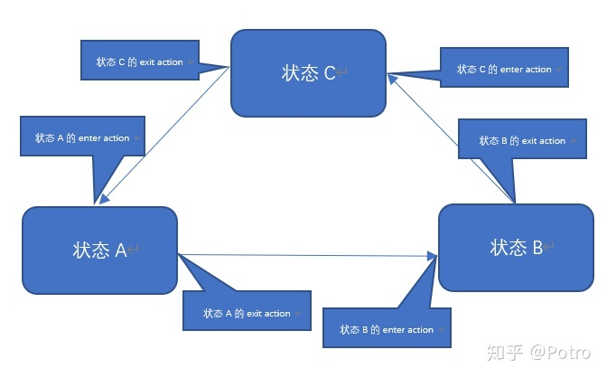
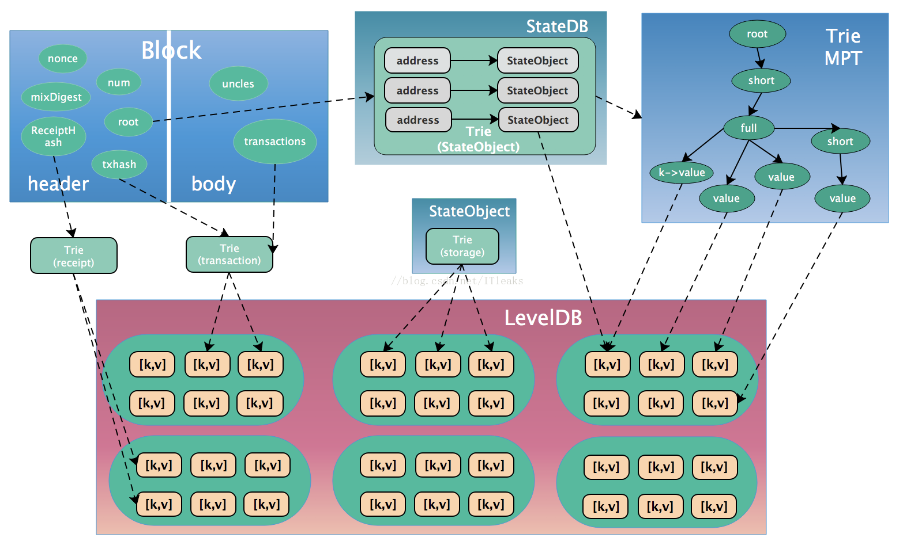

## 以太坊 EVM 虚拟机简介

<link type="text/css" rel="stylesheet" href="./link.css"/>


## 从编译开始

```text
编译器将程序员编写的源文件编译称可执行的目标程序（如.exe, .class）。像C++、Java这种高级语言（又称编译型语言）都有自己的编译器。

除了编译器之外还有一种叫做解释器，对应的就是解释性语言，最著名的例如Python，JavaScript。


各自特点
    编译器：工作效率高，时间快、空间省；交互性与动态性差，可移植性差。
    解释器：工作效率低，时间慢、空间费；交互性与动态性好，可移植性好。

```





*编译原理是计算机专业的一门重要专业课，旨在介绍编译程序构造的一般原理和基本方法。*

## 理解EVM先决条件 （别急我带你进入.）

对计算机科学中常见术语的基本了解，如[字节](https://en.wikipedia.org/wiki/Byte)、[内存](https://en.wikipedia.org/wiki/Computer_memory)和[堆栈](https://en.wikipedia.org/wiki/Stack_(abstract_data_type))是理解 EVM 的前提。 熟悉诸如 [哈希函数](https://en.wikipedia.org/wiki/Cryptographic_hash_function)、[工作量证明](https://en.wikipedia.org/wiki/Proof_of_work)和 [Merkle树](https://en.wikipedia.org/wiki/Merkle_tree)等密码学/区块链概念对理解也很有帮助




## 从账本到状态机


虽然以太坊有自己的本机加密货币 (ETH)，遵循几乎完全相同的直观规则，但它也支持更强大的功能：智能合约（solidity yul等）。 对于此更复杂的功能，需要一个更复杂的类比。 以太坊不是分布式账本，而是分布式[状态机器](https://en.wikipedia.org/wiki/Finite-state_machine)。 以太坊的状态是一个大型数据结构，它不仅保存所有帐户和余额，而且还保存一个机器状态，它可以根据预定义的一组规则在不同的区块之间进行更改，并且可以执行任意的机器代码。 在区块中更改状态的具体规则由 EVM 定义。

## 以太坊状态转换函数

EVM 的行为就像一个数学函数：在给定输入的情况下，它会产生确定性的输出。 因此，将以太坊更正式地描述为具有状态转换函数非常有帮助：

```
    Y(S, T)= S'
```
给定一个旧的有效状态 （S）> 和一组新的有效交易 （T），以太坊状态转换函数 Y（S，T） 产生新的有效输出状态 S'



## 状态

在以太坊的上下文中，状态是一个巨大的数据结构，称为调整后的 [Merkle Patricia Trie](https://ethereum.org/zh/developers/docs/data-structures-and-encoding/patricia-merkle-trie/)，使所有帐户通过哈希链接，并可回溯到存储在区块链上的单个根哈希。

```text
Patricia Merkle Trie: 提供了一种经过加密验证的数据结构，可用于存储所有 (key, value)绑定。 
```



## 交易

``` text
交易是来自帐户的密码学签名指令。 交易分为两种：一种是消息调用交易，另一种是合约创建交易。

合约创建交易会创建一个新的合约帐户，其中包含已编译的 智能合约 字节码。 每当另一个帐户对该合约进行消息调用时，它都会执行其字节码。
```


## EVM 的一些特性

```text

EVM 作为一个堆栈机运行，其栈的深度为 1024 个项(可以理解为函数之间调用的层级深度，但不是那么简单。)。 每个项目都是 256 位字，为了便于使用，选择了  256 位加密技术（如 Keccak-256 哈希或 secp256k1 签名）。

在执行期间，EVM 会维护一个瞬态内存（作为字可寻址的字节数组），该内存不会在交易之间持久存在。

然而，合约确实包含一个 Merkle Patricia(帕特里) 存储 trie（作为可字寻址的字数组），该 trie 与帐户和部分全局状态关联。

已编译的智能合约字节码作为许多 EVM opcodes执行，它们执行标准的堆栈操作，例如 XOR、AND、ADD、SUB 等。 EVM 还实现了一些区块链特定的堆栈操作，如 ADDRESS、BALANCE、BLOCKHASH 等。

```


## gas

Gwei 本身就是 ETH 的一个单位――每个 Gwei 等于 0.000000001 ETH (10^9 ETH)。 

标准的 ETH 转账一般要求 gas 限额为 21,000 单位。

在交易中，矿工报酬限额为 21,000 单位，基本费用的价格是 100 gwei。 Jordan 支付了 10 gwei 作为小费。

我们可以计算 21,000 * (100 + 10) = 2,310,000 gwei 或 0.00231 ETH。

Gas Price（100+10） *  Gas Limit(21000) = 交易手續費（Tx Fee）

交易还可以设定最高费用 (maxFeePergas)。 最高费用与实际收费之间的差额将归还

退款 = 最高费用 -（基本费用 + 优先费）。

[gas 的详细](https://ethereum.org/zh/developers/docs/gas/)

### 堆栈机 （选看）

在 计算机科学 、 计算机工程 和 编程语言实现 中， [堆栈机](https://en.wikipedia.org/wiki/Stack_machine) 是 计算机处理器 或 虚拟机 ，其中主要交互是将短期临时值移入和移出下推 堆栈 。 在硬件处理器的情况下，使用 硬件堆栈 。 堆栈的使用显着减少了所需的 处理器寄存器 。 堆栈机器通过额外的加载/存储操作或多个堆栈扩展 下推自动机 ，因此是 图灵完备的 。 


## EVM 实现 (硬核)

EVM 的所有实现都必须遵守[以太坊黄皮书](https://ethereum.github.io/yellowpaper/paper.pdf)中描述的规范。

[加文·伍德（Gavin Wood）](https://gavwood.com/) 以太坊黄皮书作者  CPP evm开发者

在以太坊的 5 年历史中，EVM 经历了几次修订，并且以各种编程语言完成了 EVM 的多种实现。

所有以太坊客户端都包含一个 EVM 实现。 此外，还有多个独立的实现方法，包括：

[Py-EVM](https://github.com/ethereum/py-evm) - Python
[evmone](https://github.com/ethereum/evmone) - C++
[ethereumjs-vm](https://github.com/ethereumjs/ethereumjs-monorepo) - JavaScript
[eEVM](https://github.com/microsoft/eevm) - C++
[Hyperledger Burrow](https://github.com/hyperledger/burrow) - Go

延伸阅读

[以太坊机器码](https://www.ethervm.io/)
[以太坊 EVM 实现](https://takenobu-hs.github.io/downloads/ethereum_evm_illustrated.pdf)