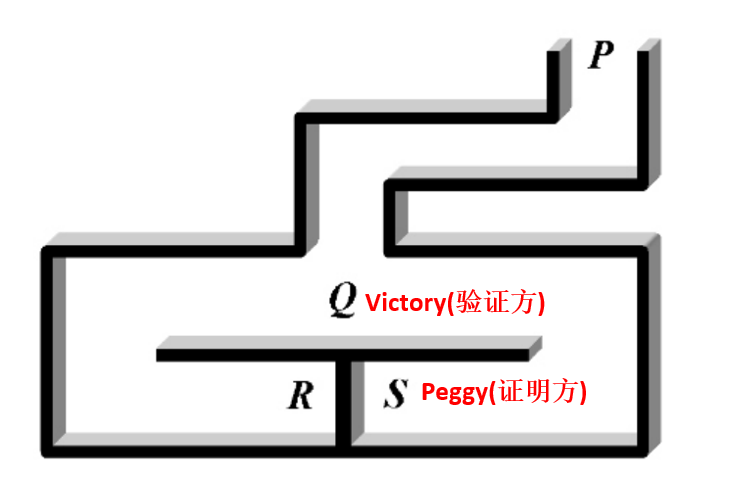
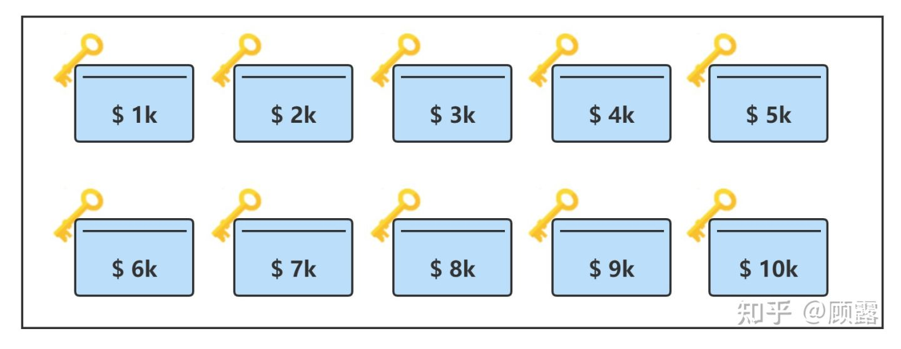
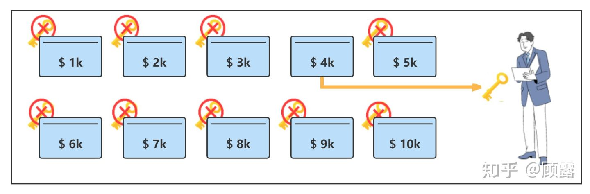
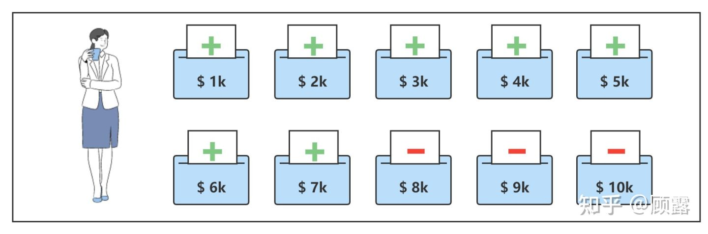
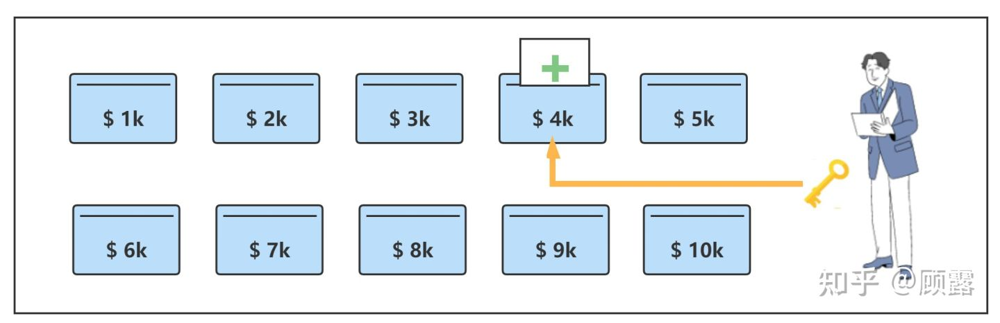
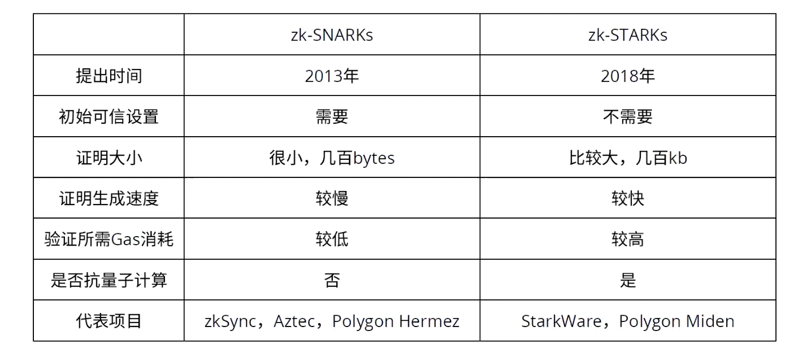
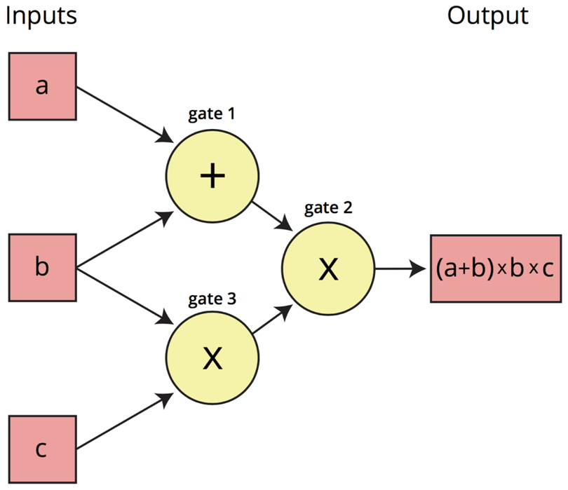

# 深入浅出零知识证明

<link type="text/css" rel="stylesheet" href="./link.css"/>

ZKP（**zero knowledge proofs**）


## 什么是零知识证明 

```text

它是密码学中使用的一种方法，它允许一方（证明者）向另一方（验证者）出示信息的正确性，而无需透露有关该方的任何其他讯息。

该定义最初是由麻省理工学院的研究人员Shafi Goldwasser，Silvio Micali 和Charles Rakoff 在1958年的论文《交互式证明系统的知识复杂性》中提出的。 


R和S之间存在一道密门，并且只有知道咒语的人才能打开。Peggy知道咒语并想对Victor证明，但证明过程中不想泄露咒语。他该怎么办呢？

Victor 从 P -> Q
Peggy  从 S -> R

Victor 见到了 Peggy

微软 google 等公司推崇的去密码化
```

既要保守秘密,又要别人相信你.(安全,隐私)

[交互式证明体系](https://zh.m.wikipedia.org/zh-sg/%E4%BA%A4%E4%BA%92%E5%BC%8F%E8%AF%81%E6%98%8E%E7%B3%BB%E7%BB%9F)




```text
用于证明某些已知的东西，而不直接揭示已知的资讯。零知识证明是间接证明，允许您证明自己知道一个秘密，而无需向其他人透露该秘密。 
```
## ZPK的三个主要属性和两种类型

```text
完整性－如果证明者知道验证信息，那么他可以说服验证者。
正确性－如果证明者不知道验证信息，那么他几乎不可能欺骗验证者。
零知识－验证者即使行为不诚实，也不会从证明者那里得知除验证信息以外任何其他讯息。

交互的：
    验证者独立地实时询问证明者﹔
非交互式的（zk-SNARKs）：
    不需要验证者和证明者之间的直接通讯；
    验证者可以在事实之后验证信息的真实性。 
```


## 零知识证明的应用场景（隐私）

```text
1.零知识证明可以为公共区块链引入更多的隐私。例如，四大匿名代币ZEC, XMR, DASH 就是基于零知识证明的加密货币，这些匿名代币在流转过程中隐匿信息，我们无法通过区块链查询到交易金额甚至钱包地址。

2.财务：匿名支付，征信系统。例如，贷款申请人可以证明他们的收入在可贷款的范围内，而无需透露他们的确切工资。

3.投票：如果在公共区块链进行投票，则不需要值得信赖的第三方来验证结果。因此，ZKP可以使投票系统匿名，合格的选民可以在不透露身份的情况下证明他们投票的权利。

4.认证：匿名身份验证系统中，一方希望通过密码等一些秘密资讯向第二方证明其身份，但不让第二方了解具体信息。ZKP 可以帮助执行此类资讯交换。

5.讯息传递：通过ZKP和区块链，可以让您要发送到的邮箱之外，没有人可以阅读私人邮件。我们可以在消息传递世界中建立端到端的信任，而不会泄露任何额外的资讯。
```


## 用例子理解 ZPK

### 例子1：用户注册

用户在系统注册时，系统不会保存用户的密码明文，而是保存了密码的哈希值；用户在登录系统时，只需要输入注册时的密码，系统会根据用户输入密码产生的哈希值与系统数据库保存的哈希值进行比对。如果一致，则系统认为——当前登录用户知道该账号的密码。

这样，用户不需要告诉网站密码，就能证明自己的身份。这其实就是一种零知识证明。

### 例子2：在校大学生实习

A要去公司实习，公司要求A在校所有功课没有挂科，才有资格加入公司。A虽然所有功课都没有挂科，但都在61、62左右徘徊；A不想让公司看到自己的成绩单，于是A委托学校开了一个证明：证明A在校所有功课全部及格。并交到了公司，加入了公司。

这样，A既没有暴露自己的确切考试成绩，又向公司证明自己满足要求。这其实就是零知识证明。

### 例子3: 租房问题

在开始前我们假设，这套房子的租金是$1k/月，房东要求房客需要出示至少$4k/月的收入证明。

在一个房间里有十个盒子，盒子上分别写着 $1k / $2k / ... / $10k，作为标记。每个盒子上都有一把锁，彼此互相无法开启。每个盒子顶部有一条缝 (可以塞纸条进去)，但塞进去的纸条只有用钥匙开启才能看到内容。

 

这个时候，中介小黄先进去，把第四个写着 $4k (也就是房东要求的最低收入证明) 的盒子钥匙拿走，并把其他所有盒子的钥匙都销毁，也就是说，之后小黄只能看 4 号盒子的内容了。

 

此时小美进入房间。小美需要准备一些上面有 “+” 和 “-” 的卡片，并按照盒子上的金额，把她收入能覆盖的盒子全部放入 “+” 卡片，而超出她收入的盒子放 “-” 卡片。在这个例子里，你可以看到小美的收入为 $7k/月。完成后小美离开房间。

 

最后一步，小黄回到房间，用他的 4 号钥匙开启 4 号盒子。

这个时候，如果他看到 “+”，就是说，小美满足了条件，看到 “-”，就是小美不满足条件。

 

你可能已经注意到了，整个验证过程中，小黄得到了自己想要的答案，小美也没有暴露任何信息，而这就是零知识证明的神奇之处。

在真实世界里，情况比这会略微复杂一些，比如我们会使用自动化数据获取而不是依赖手动标记，会使用哈希而不是明文的标识，但核心逻辑是类似的


## 零知识证明的相关算法

谈到ZKP算法，大伙可能听过一些，比如zk-snark，zk-stark, bulletproof， aztec， plonk等等。

> v神多次站队它

> 用户隐私保护

> 扩容,算力,存储,保障安全

#### zk-SNARKs (简洁的非交互式知识论证) zk-STARKs 升级版本

SNARK的全称是Succinct Non-interactive ARgument of Knowledge。这个名词由三个维度组成：




```text

1、简短（Succinct）：证明本身要足够简短，最好验证证明是O(logN)甚至是O(1)的复杂度。
2、无交互性（Non-interactive）：整体流程没有任何交互，也就是说证明方可以扔出一大串乱码往你桌上一拍然后就走人，你之后再去验证这串乱码就可以验证他的证明。
3、知识的表达（Argument of Knowledge）：大概的意思就是说你要证明的东西得是能表达知识的（Proof of Knowledge）。一句话总结就是，你证明的东西是有价值的，通过计算得到的。

也就是说，我们索要经过的步骤是：
>>> 证明某一个秘密 → 程序计算 → 算法 → 多项式 → 证明多项式。

```



[ZK-SNARK](ZK-SNARK.pdf)

