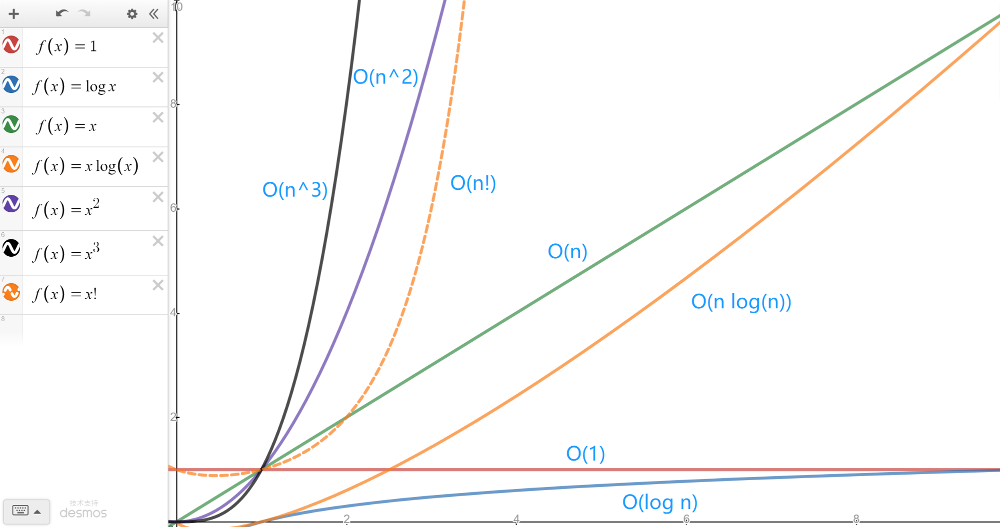

---
---

## 算法复杂度
- 常数阶O(1)
- 对数阶O(logN)
- 线性阶O(n)
- 线性对数阶O(nlogN)
- 平方阶O(n²)
- 立方阶O(n³)
- K次方阶O(n^k)
- 指数阶(2^n)

## 常见数据结构图

### 线性结构
- 链表 
- 双向链表 
- 栈 
- 队列 

### 非线性结构
- 树 
- 优先队列（堆） 
- 散列 

## 常见算法
- 排序 
- 图算法 
- 贪心算法 
- 分治算法
- hash算法
- 图
- 深度优先DFS
- 广度优先BFS

## 常见加密算法
    对称加密算法有DES、3DES、Blowfish、IDEA、RC4、RC5、RC6和AES
    非对称加密算法有：RSA、ECC、Diffie-Hellman、El Gama
    Hash算法有MD2、MD4、MD5、HAVAL、SHA 、CRCRSA

## 数字货币常用算法
    默克尔树
     
