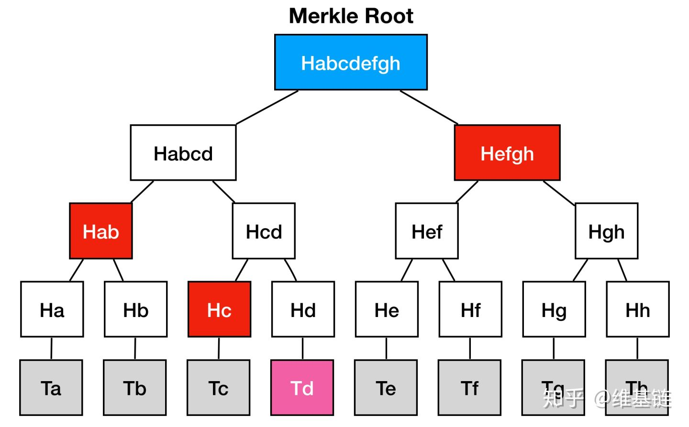
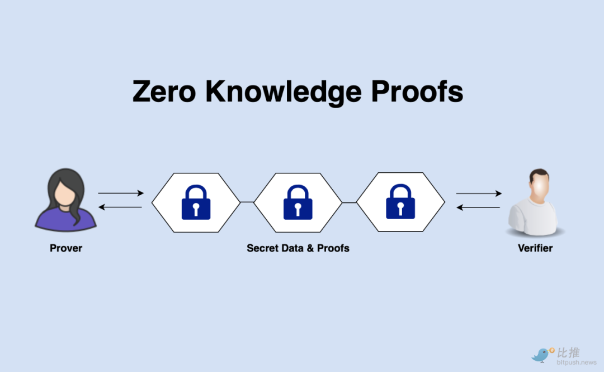
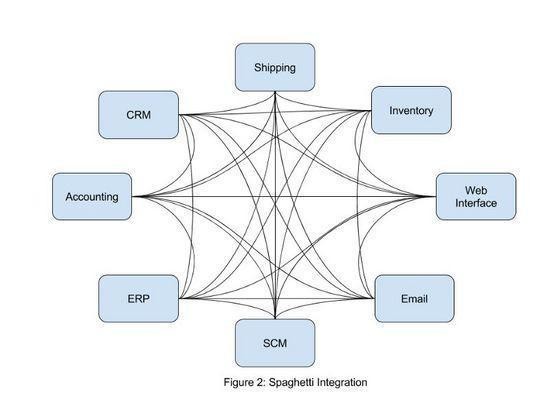

# Merkletree 在区块链中的应用

## 默克尔树（Merkletree，MT）

```text
MT是一种哈希二叉树，1979年由RalphMerkle发明。在计算机科学中，二叉树是每个节点最多有两个子树的树结构，
每个节点代表一条结构化数据。通常子树被称作“左子树”（left subtree）和“右子树”（right subtree）。
二叉树常被用于实现数据快速查询。
```




## Merkle树结构

```text
由一个根节点（root）、一组中间节点和一组叶节点（leaf）组成。叶节点（leaf）包含存储数据或其哈希值，中间节点是它的两个孩子节点内容的哈希值，根节点也是由它的两个子节点内容的哈希值组成。所以Merkle树也称哈希树。
```

## 哈希树的特点

```text
叶节点存储的是数据文件，而非叶节点存储的是其子节点的哈希值（Hash，通过SHA1、SHA256等哈希算法计算而来），这些非叶子节点的Hash被称作路径哈希值（可以据其确定某个叶节点到根节点的路径）,

叶节点的Hash值是真实数据的Hash值。因为使用了树形结构, 其查询的时间复杂度为 O(logn)，n是节点数量。
```


[什么是密码学中的哈希函数](https://www.thesslstore.com/blog/what-is-a-hash-function-in-cryptography-a-beginners-guide/)

## 应用场景
## 默克尔树的典型应用场景包括：

* 快速比较大量数据：当两个默克尔树根相同时，则意味着所代表的数据必然相同（哈希算法决定的）。

* 快速定位修改：例如上例中，如果 D1 中数据被修改，会影响到Hash0-0，Hash0 和 Root。因此，沿着 Root --> 0 --> 0-0，可以快速定位到发生改变的 D1；

* 零知识证明：例如如何证明某个数据（D0……D3）中包括给定内容 D0，很简单，构造一个默克尔树，公布 N0，N1，N4，Root，D0拥有者可以很容易检测 D0 存在，但不知道其它内容。



相对于 Hash List，MT的明显的一个好处是可以单独拿出一个分支来（作为一个小树）对部分数据进行校验，这个很多使用场合就带来了哈希列表所不能比拟的方便和高效。正是源于这些优点，MT常用于分布式系统或分布式存储中

## 在分布式存储系统中的应用原理

为了保持数据一致，分布系统间数据需要同步，如果对机器上所有数据都进行比对的话，数据传输量就会很大，从而造成“网络拥挤”。为了解决这个问题，可以在每台机器上构造一棵Merkle

Tree，这样，在两台机器间进行数据比对时，从Merkle

Tree的根节点开始进行比对，如果根节点一样，则表示两个副本目前是一致的，不再需要任何处理；如果不一样，则沿着hash值不同的节点路径查询，很快就能定位到数据不一致的叶节点，只用把不一致的数据同步即可，这样大大节省了比对时间以及数据的传输量。



## 比特币中的Merkle Tree

比特币区块链系统中的采用的是Merkle二叉树，它的作用主要是快速归纳和校验区块数据的完整性，它会将区块链中的数据分组进行哈希运算，向上不断递归运算产生新的哈希节点，最终只剩下一个Merkle根存入区块头中，每个哈希节点总是包含两个相邻的数据块或其哈希值。

在比特币系统中使用Merkle树有诸多优点：首先是极大地提高了区块链的运行效率和可扩展性，使得区块头只需包含根哈希值而不必封装所有底层数据，这使得哈希运算可以高效地运行在智能手机甚至物联网设备上；其次是Merkle树可支持“简化支付验证协议”（SPV），即在不运行完整区块链网络节点的情况下，也能够对交易数据进行检验。所以，在区块链中使用Merkle树这种数据结构是非常具有意义的。


