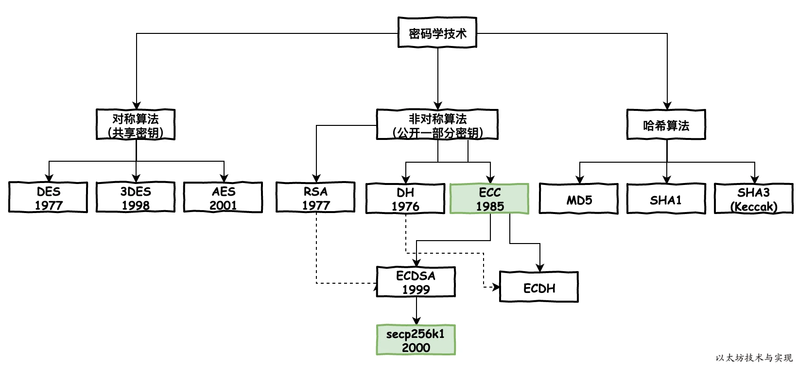
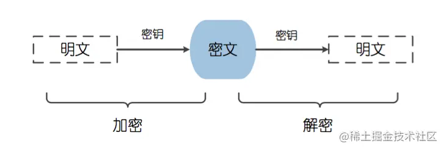
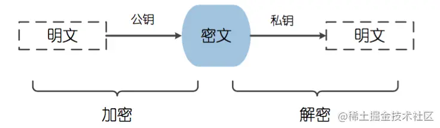

## 密码学，现代计算机科学的基石

 

## 加密

khoor,zruog!
## 什么是密码学

```text
密码学是研究编制密码和破译密码的技术科学。研究密码变化的客观规律，应用于编制密码以保守通信秘密的，称为编码学；应用于破译密码以获取通信情报的，称为破译学，总称密码学。简单地说，密码学是对保密通信技术的深入研究。当人们只希望发送方和接收方查看消息内容时，他们经常使用密码学。

密码学已经存在了几个世纪，最早密码学出现在古埃及，克努霍*二世(Khumhotep Il)的追随者在他的坟墓上刻了加密符号。密码学早在公元前400多年就已经产生，人类使用密码的历史几乎与使用文字的时间一样长，密码学的发展大致可以分为 3 个阶段: 1949 年之前的古典密码学阶段; 1949 年至 1975 年密码学成为科学的分支; 1976 年以后对称密钥密码算法得到进一步发展，产生了密码学的新方向—公钥密码学。

1976 年，W.Diffie 和 M.Hellman 在发表的文章“密码学的新方向”中首次公开提出了公钥密码( Public-key Cryptography) 的概念。公钥密码的提出实现了加密密钥和解密密钥之间的独立，解决了对称密码体制中通信双方必须共享密钥的问题，在密码学界具有划时代的意义。
```

### 密码学能干什么？

身份认证，信息加密，信息签名，隐私保护，软硬件安全，国家安全，军事安全等。
从凯撒密码，到二战的德国Enigma，到印象到币圈的ECC.


### 密码转换流程

输入明文 -> (加密) -> 生成密文 -> 传输密文 -> (接收) -> (解密) -> (得到明文)

### CIA  

```text〔筆畫〕
密码学解决什么问题呢？ 信息三要素！
    机密性（Confidentiality）指只有授权用户可以获取信息。
    完整性（Integrity）指信息在输入和传输的过程中，不被非法授权修改和破坏，保证数据的一致性。
    可用性（Availability）指保证合法用户对信息和资源的使用不会被不正当地拒绝。
```
## 解密

hello world!


Enigma  26个字母在“ENIGMA”机中能替代  8万亿个谜文字母
图灵 最早的电动机械的方式，用数学的方法破解。   <模仿游戏>

## base

明文 加密
密文 解密

隐写
字母组代（恺撒密码）

## 对称加密

 .

``` text
加密和解密使用相同密钥的加密算法。
AES DES 3DES
```

## hash函数


``` text
一种从任何一种数据中创建小的数字“指纹”的方法。 信息摘要。
MD5 SHA1 SHA2(SHA-224、SHA-256、SHA-384、SHA-512)` SHA3(keccak)
     如果 key1 ≠ key2，那 hash(key1) ≠ hash(key2)

深入：https://www.zhihu.com/question/20820286
```


## 非对称加密

 .

``` text

使用公钥/私钥对中的公钥来加密明文，然后使用对应的私钥来解密密文的过程。

RSA,DSA,DH,ECC

RSA 三个大神  
算法的名字以发明者的名字命名：Ron Rivest, Adi Shamir 和Leonard Adleman。
对极大整数做*因数分解*的难度决定了 RSA 算法的可靠性。

区块链 ECC 国密 m2 ECDSA
一条椭圆曲线 y^2=x^3+b
mac Grapher

https://zhuanlan.zhihu.com/p/36326221
```

## 深入了解

```
更深入的了解
https://juejin.cn/post/6844903638117122056
```

## gpg 使用初步

```text

用GPG保护你的隐私信息安全。

gpg 默认使用 RSA

https://www.ruanyifeng.com/blog/2013/07/gpg.html

```
