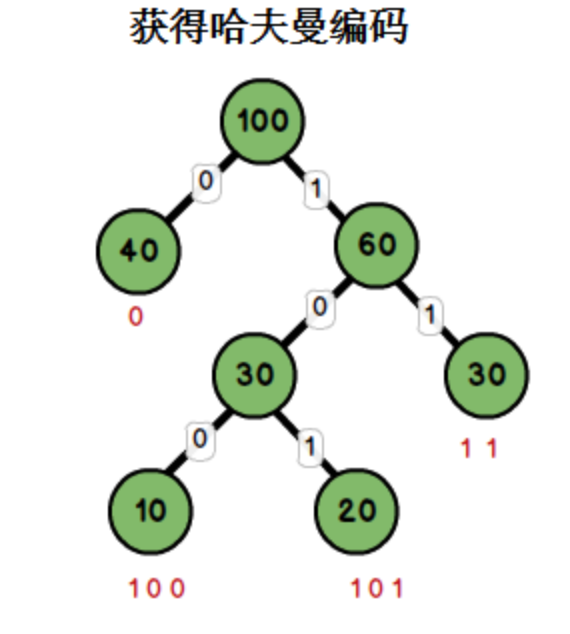

# Huffman 算法

> 计算机基础算法之 Huffman


```text
哈夫曼编码（Huffman Coding）是一种编码方式，也称为“赫夫曼编码”，是David A. Huffman1952年发明的一种构建极小多余编码的方法。
在计算机数据处理中，哈夫曼编码使用变长编码表对源符号进行编码，出现频率较高的源符号采用较短的编码，出现频率较低的符号采用较长的编码，使编码之后的字符串字符串的平均长度 、期望值降低，以达到无损压缩数据的目的。
```

举个例子，现在我们有一字符串：<font size=5px>this is an example of a huffman tree</font>

这串字符串有36个字符，如果按普通方式存储这串字符串，每个字符占据1个字节，则共需要

    36 * 1 * 8 = 288bit。

如果我们能够按如下编码：

字母 | 频率 |编码 ||字母 |频率 |编码
-|-|-|-|-|-|-
space |7 |111 |  |s |2 |1011
a |4 |010 |  |t |2 |0110
e |4 |000 |  |l |1 |11001
f |3 |1101 |  |o |1 |00110
h |2 |1010 |  |p |1 |10011
i |2 |1000 |  |r |1 |11000
m |2 |0111 |  |u |1 |00111
n |2 |0010 |  |x |1 |10010

编码这串字符串，只需要：
(7+4+4)x3 + (3+2+2+2+2+2+2)x4 + (1+1+1+1+1+1)x 5 = 45+60+30 = 135bit
编码这串字符串只需要135bit！

    288-135 = 153bit。

如何获取每个字符串的编码呢？这就需要哈夫曼树了。

源字符编码的长短取决于其出现的频率，我们把源字符出现的频率定义为该字符的权值。

## 哈夫曼树

哈夫曼又称最优二叉树。是一种带权路径长度最短的二叉树。


对10，20，30，40构建哈夫曼树。

* 路径与路径长度：
```text
从树中一个节点到另一个节点之间的分支构成了两个节点之间的路径，路径上的分支数目称作路径长度。若规定根节点位于第一层，则根节点到第H层的节点的路径长度为H-1.如树b：100到60 的路径长度为1；100到30的路径长度为2；100到20的路径长度为3。
```
* 树的路径长度：
```text
从根节点到每一节点的路径长度之和。树b的路径长度为1+1+2+2+3+3 = 12.
```
* 节点的权：
```text
将树中的节点赋予一个某种含义的数值作为该节点的权值，该值称为节点的权；
```
* 带权路径长度：
```text
从根节点到某个节点之间的路径长度与该节点的权的乘积。例如树b中，节点10的路径长度为3,它的带权路径长度为10 * 3 = 30；
```
* 树的带权路径长度：
```text
树的带权路径长度为所有叶子节点的带权路径长度之和，称为WPL。树b的WPL = 1x40+2x30+3x10+3x20 = 190.而哈夫曼树就是树的带权路径最小的二叉树。
```

# 构造步骤

```text
假设有n个权值，则构造出的哈夫曼树有n个叶子节点.n个权值记为{w1,w2,w3...wn},哈夫曼树的构造过程为：

    * 将w1,w2,w3...wn看成具有n棵树的森林，每棵树仅有一个节点。
    * 从森林中，选取两棵根节点权值最小的树，两棵树分别作为左子树与右子树，构建一棵新树。新树的权值等于左右子树权值之和。
    * 从森林中删除两棵权值最小的树，将构建完成后的新树加入森林中。
    * 重复2、3步骤，直到森林只剩一棵树为止。这棵树便是哈夫曼树。

 上图树b为一棵哈夫曼树，它的叶子节点为{10，20，30，40}，以这4个权值构建树b的过程为：
```


为{10，20，30，40}这四个权值构建了哈夫曼编码后，我们可以由如下规则获得它们的哈夫曼编码：

从根节点到每一个叶子节点的路径上，左分支记为0，右分支记为1，将这些0与1连起来即为叶子节点的哈夫曼编码。



权值 |编码
-|-
10 |100
20 |101
30 |11
40 |0

由此可见，出现频率越高的字母（也即权值越大），其编码越短。这便使编码之后的字符串的平均长度、期望值降低，从而达到无损压缩数据的目的。


