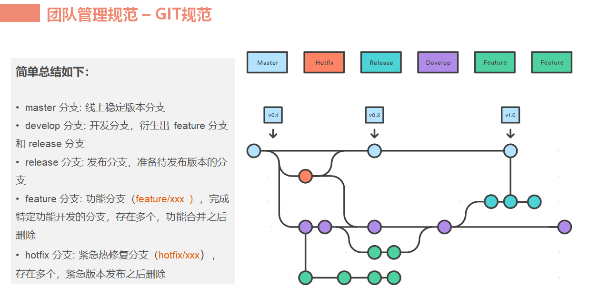
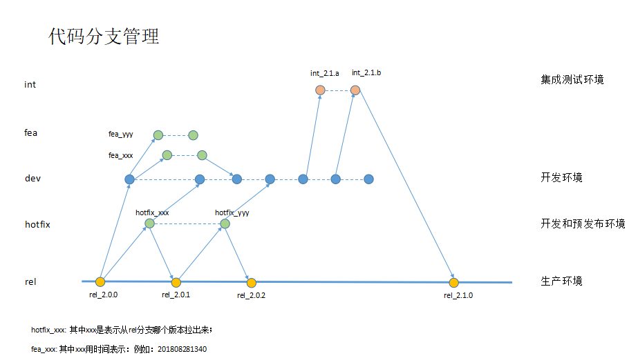

#git 检查脚本
pwd_push=`pwd`
git_obj="/Users/yy/work/"
for i in `ls ${git_obj}`
do
    if [ -d "${git_obj}"$i"/.git" ]
    then
        cd  ${git_obj}$i
        echo -e "\033[32m `pwd` \033[0m"
        git status
        echo
    fi
done
cd ${pwd_push}

/mnt/d/aaa/yy/bin/gu /mnt/d/aaa

git config --global  pull.rebase false
git config --global core.filemode false

git config --global core.autocrlf input
git config --global core.safecrlf true

echo "export EDITOR=vim" >> /etc/profile

安装依赖的包
yum install curl-devel expat-devel gettext-devel openssl-devel zlib-devel gcc perl-ExtUtils-MakeMaker

下载git源码并解压缩
wget https://github.com/git/git/archive/v2.3.0.zip
unzip v2.3.0.zip
cd git-2.3.0

make prefix=/usr/local/git all
make prefix=/usr/local/git install

 git bisect 查找错误分支 未详细展开   

 git config --global user.name "Your Name Comes Here"
 git config --global user.email you@yourdomain.example.com

git status 乱码
git config --global core.quotepath false

git commit 乱码
git config --global i18n.commitencoding utf-8

 关闭mode 效验
 git config --add core.filemode false

 拉取指定分支
 git clone -b dev_jk https://git.oschina.net/mysrc.git

 git init
 touch README.md
 git add README.md
 git commit -m "first commit"
 git remote add origin https://git.oschina.net/mysrc.git
 git push -u origin master

#添加子模块：
 git submodule add https://git.oschina.net/mysrc.git
 git clone --recursive 递归子模块

 git submodule add ~/git/libs/lib1.git libs/lib1
 #git会在项目下生成.gitmodule

 [submodule "libs/lib1"]
        path = libs/lib1
        url = ~/git/libs/lib1.git

 #进入项目根目录，初始化submodule,更新submodule(必须在根目录执行命令)
 cd ../../
 git submodule init
 git submodule update

打标签
git tag -a v0.1.2 -m “0.1.2版本” 9c8e6795ee03b97a14c828345098afee7e80c344
提交所有标签
git push origin –tags
git push origin v0.1.2 # 将v0.1.2标签提交到git服务器
git checkout tag名  检出tag

git describe --all  查看最近的tag

忽略自认证
 git config --global http.sslVerify false

忽略更新文件
 git update-index --assume-unchanged file_path/file_name
恢复文件更新
 git update-index --no-assume-unchanged

 .gitignore  中写入不想被管理的文件
# 以'#'开始的行，被视为注释.                                                                                                                          
# 忽略掉所有文件名是 foo.txt的文件.
foo.txt
# 忽略所有生成的 html文件,
*.html
# foo.html是手工维护的，所以例外.
!foo.html
# 忽略所有.o和 .a文件.
*.[oa]

 Git init  创建库
 Git add   添加文件

 git config --list  查看配置

 Git commit  提交
 git commit -m "Initial commit of gittutor reposistory"
 git commit --amend  修改注视

 git checkout dev
 git rebase master # 将dev上的c2、c5在master分支上做一次衍合处理

 git rebase -i HEAD~3
    表示要修改当前版本的倒数第三次状态。
      pick:*******
    如果你要修改哪个，就把那行的pick改成edit，然后退出。

 # git提示出现了代码冲突，此处为之前埋下的冲突点，处理完毕后
 git add readme # 添加冲突处理后的文件

 git rebase --continue # 加上--continue参数让rebase继续处理

 在任何时候，你可以用--abort参数来终止rebase的行动，并且"mywork" 分支会回到rebase开始前的状态。
 git rebase --abort

 Git status
 Git log -1
 Git log --stat –summary （显示每次版本的详细变化）
 git log -p -2
 git log --status
 git log --pretty=oneline    查看版本号
 git log --author="chenjianhui"   按用户查看

 Git show  查看更改内容
 git ls-files -d 列出删除的文件
 Git checkout   检出文件
 git ls-files -d | xargs -i git checkout {}  #恢复删除的文件

 Git rm    删除文件
 git rm
 git rm --cached readme.txt
 Git mv   重命名
 git mv file_from file_to

 Git merge  进行分支合并。
 git diff
 git diff --name-only   只取差异文件
 git diff --cached
 git diff hash1 hash2

 Git reset  还原版本
 git reset --hard 38679ed709fd0a3767b79b93d0fba5bb8dd235f8 回退到一个版本
 git commit --amend  重新提交
 git reset HEAD benchmarks.rb  撤销
 git reset --hard：彻底回退到某个版本，本地的源码也会变为上一个版本的内容
 git reset --soft：回退到某个版本，只回退了commit的信息，不会恢复到index   file一级。如果还要提交，直接commit即可

 Git revert  撤销某次提交，但是这次撤销也会作为一次提交进行保存 版本会递增

 放弃本地修改 的改法
 git reset --hard
 git pull

 当前分支是maser分支，test分支上的代码完全覆盖master分支。
 git reset --hard origin/test

 查看历史日志
 git reflog

 合并差异  保留本地
 git stash
 git pull
 git stash pop

 git stash #将工作区现场(已跟踪文件)储藏起来，等以后恢复后继续工作。
 git stash list #查看保存的工作现场
 git stash apply #恢复工作现场
 git stash drop #删除stash内容
 git stash pop #恢复的同时直接删除stash内容
 git stash apply stash@{0} #恢复指定的工作现场，当你保存了不只一份工作现场时。

 git remote -v  查看远程仓库
 git remote  添加仓库
 git remote
 git remote rm    移除远程仓库
 git remote readme  重命名远程仓库

 git pull    从服务器获取最新代码
 Git push    提交至远程服务器
 git push origin master
分支操作
 git merge hotfix  当前合并到分支
 git push origin serverfix    推送远程分支
 git fetch origin   抓取分支
 git push origin :serverfix   删除远程分支

 git push a1:a2  将A1新增成A2

1.保留你本地的修改
git merge --abort
git reset --merge
合并后记得一定要提交这个本地的合并
然后在获取线上仓库
git pull

 git fetch 抓取远程 获取最新代码 不会自动merge

 放弃本地修改
 git fetch --all
 git reset --hard origin/master

 git branch  列出本地分支
 git branch –r 列出服务器git库的所有分支。
 git branch –D 分支名  删除分支

 git branch testing  建立分支
 git checkout  testing  切换到分支

  
 git branch -f master HEAD~3 强制改变分支 向上三个版本
 git branch -f main c6  将分支指向hash

  #删除远程分支
 git push origin --delete [branch-name]
 git branch -dr [remote/branch]

 分支合并(将dev合并到master)
 git checkout master         
 git merge dev

添加多个仓库
 git remote add 仓库名称 仓库地址
 多个远程仓库 注意冒号必须
 git pull origin :dev_sprint1

 git cherry-pick 用于把另一个或多个本地分支的commit修改应用到当前分支。
 git checkout dev
 git cherry-pick 38361a68  把38361a68提交到当前分支
 git cherry-pick  c2 c4

 git-show-branch （查看当前分支的提交注释及信息）
 git-show-branch -all（查看所有分支的提交注释及信息）例如：
 git whatchanged  查看当前分支的操作记录

 git rm -f --cached a.txt  彻底清理 慎用

git reset --hard 98abc5a   恢复版本进行恢复
git diff HEAD              查看当前修改信息

提交版本
git add . --all

提交所有
git add .
git commit

git config --global user.name "Your Name"
git config --global user.email you@example.com
设置默认编辑器
git config --global core.editor "gvim "

查看当前访问方法
$ git remote -v
origin https://github.com/someaccount/someproject.git (fetch)
origin https://github.com/someaccount/someproject.git (push)

修改 ssh 访问方法
git remote set-url origin git@github.com:someaccount/someproject.git

建立.ssh目录（注意，是.ssh。。有个点！)
chmod 700 -R .ssh
在B中使用ssh-keygen -t rsa 建立密匙和公匙，即id_rsa 和 id_rsa.pub
将id_rsa.pub 拷贝到B的/home/git/.ssh/中，添加到authorized_keys文件后，如果没有这个文件可以如下:
cat id_rsa.pub
 authorized_keys
将authorized_keys 权限改为644

git archive  生成压缩包
git archive master --format zip > rf.zip

--graph 显示分支图形

git log --graph --all --format=format:'%C(bold blue)%h%C(reset) - %C(bold green)(%ar)%C(reset) %C(white)%s%C(reset) %C(bold white)—     %an%C(reset)%C(bold yellow)%d%C(reset)' --abbrev-commit --date=relative

git server
yum install git-core

创建git用户

$ sudo adduser \
  --system \
  --shell /bin/sh \
  --gecos 'git version control' \
  --group \
  --disabled-password \
  --home /home/git \
  git

$ ssh-keygen -t rsa
$ sudo cp ~/.ssh/id_rsa.pub /tmp/
$ sudo -H -u git gitosis-init < /tmp/id_rsa.pub
$ sudo chmod 755 /home/git/repositories/gitosis-admin.git/hooks/post-update

git init --bare git_android

git init --bare --shared Repo_name.git   (默认生成一个master分支)

git clone git@{你的ip}:gitosis-admin.git

fork 后操作

查看远程状态
git remote -v

确定一个将被同步给 fork 远程的上游仓库
git remote add upstream

同步上游内容
git fetch upstream

合并上游内容 并提交给本地分支
git checkout master
git merge upstream/master
git push origin master

备份成单个文件
git bundle create /tmp/foo-all --all
git bundle list-heads /data/foo-all
还原
git clone ./reponame.bundle reponame

.gitignore

# 以'#'开始的行，被视为注释.
# 忽略掉所有文件名是 foo.txt的文件.
foo.txt
# 忽略所有生成的 html文件,
*.html
# foo.html是手工维护的，所以例外.
!foo.html
# 忽略所有.o和 .a文件.
*.[oa]

分支中忽略
在项目根目录下新建文件.gitattributes，然后文件中写入需要忽略的文件名 + merge=ours, 一个文件占一行 例：
忽略config.xml 文件
config.xml merge=ours
如果设置了没有起效，在根目录下运行命令行 git config merge.ours.driver true 进行config配置

##  git gpg

git config --global commit.gpgsign true

gpg --list-secret-keys --keyid-format=long

git config --global user.signingkey 35F5FFB2
git config --global gpg.program gpg

## git lfs

    brew install git-lfs
    git lfs install

Windows

    下载安装 windows installer
    运行 windows installer
    在命令行执行 git lfs install

使用

    执行 git lfs install 开启lfs功能
    使用 git lfs track 命令进行大文件追踪 例如git lfs track "*.png" 追踪所有后缀为png的文件
    使用 git lfs track 查看现有的文件追踪模式
    提交代码需要将gitattributes文件提交至仓库. 它保存了文件的追踪记录
    提交后运行git lfs ls-files 可以显示当前跟踪的文件列表
    将代码 push 到远程仓库后，LFS 跟踪的文件会以『Git LFS』的形式显示:
    clone 时 使用'git clone' 或 git lfs clone均可
